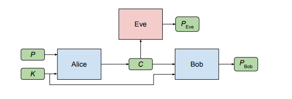
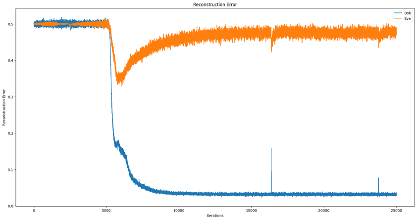
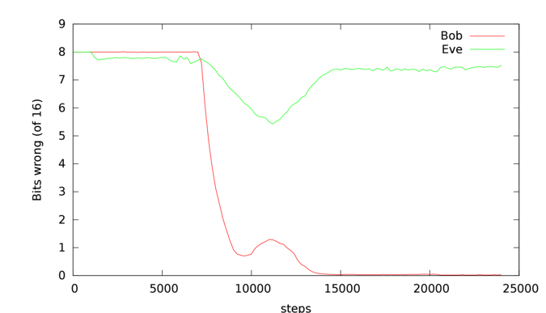

# LEARNING TO PROTECT COMMUNICATION WITH ADVERSARIAL NEURAL CRYPTOGRAPHY

### Problem Statement

The aim of the project was to experiment whether neural networks can learn to use cryptography to protect information from other neural networks. Specifically,  focusing on ensuring confidentiality properties in a multiagent system, and the properties are specified in terms of an adversary. Thus, in this case a system consists of neural networks named Alice and Bob, and are aiming to limit what a third neural network named Eve learns from eavesdropping on the communication between Alice and Bob. No specific cryptographic algorithms are imposed on these neural networks; instead,  train end-to-end, adversarially.

### Solution Proposed
It considered a classic scenario in security involving three parties such as Alice, Bob, and Eve.Typically, Alice and Bob wish to communicate securely, and Eve wishes to eavesdrop on their communications.Thus, the desired security property is secrecy, and the adversary is a ‘passive attacker’ that can intercept communications but  cannot initiate sessions, inject messages, or modify messages in transit.
And for the encryption and decryption purposes Symmetric encryption is being used that is same key will be used for both encryption and decryption.

### Architecture
 </img>

### Implementation
    
- Using Deep Neural Network and Convolutional Neural Network as backbone, the code is present in `code.ipynb`

- For using RNN, LSTM, GRU as backbone,
    -  Go to the RNN_LSTM_GRU folder and tweak the hyperparameters present in  config.yaml.
    - Put your wandb details if you want to log the results in wandb.
    - Run `python train.py` to see the results

### Results
 </img>
 </img>
